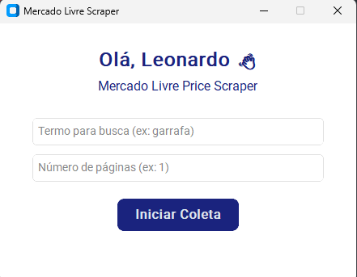

# 🛒 Mercado Livre Price Scraper

Um scraper com interface moderna em Python para coletar produtos do Mercado Livre e gerar um arquivo Excel formatado.

## ✨ Funcionalidades

- 🔍 Busca produtos no Mercado Livre com base em um termo.
- 📄 Coleta múltiplas páginas automaticamente.
- 📊 Geração de planilha Excel (`.xlsx`) com dados organizados.
- 🖥️ Interface gráfica com `customtkinter`, leve e intuitiva.

## 📸 Interface



## 📁 Arquivos gerados

Planilha Excel com colunas para:

- Produto
- Preço

## 🧰 Tecnologias usadas

- Python 3.8+
- `requests` e `BeautifulSoup4` para scraping
- `pandas` para manipulação de dados e exportação Excel
- `openpyxl` para estilização da planilha Excel
- `customtkinter` para interface gráfica moderna

## 🚀 Como usar

Clone este repositório:

```bash
git clone https://github.com/Leonardoabs/scraper-precos-mercadolivre
cd mercadolivre-price-scraper
```

Crie um ambiente virtual (opcional, mas recomendado):

```bash
python -m venv venv
source venv/bin/activate  # Linux/macOS
venv\Scripts\activate     # Windows
```

Instale as dependências:

```bash
pip install -r requirements.txt
```

Execute o programa:

```bash
python controller.py
```

Na interface, digite o termo da busca (ex: garrafa) e o número de páginas que quer coletar.

O programa gera um arquivo Excel no formato `produtos_<termo>.xlsx` com os dados coletados.

## 🛠️ Possíveis melhorias

- Implementar suporte a filtros avançados (categoria, faixa de preço, etc).
- Adicionar opção para exportar dados em CSV ou JSON.
- Melhorar tratamento de erros e feedback para usuário.
- Suporte a múltiplos idiomas.
- Otimização da coleta para maior velocidade e confiabilidade.

## 🤝 Contribuição

Contribuições são bem-vindas! Para sugerir melhorias ou reportar problemas, abra uma issue ou envie um pull request.
